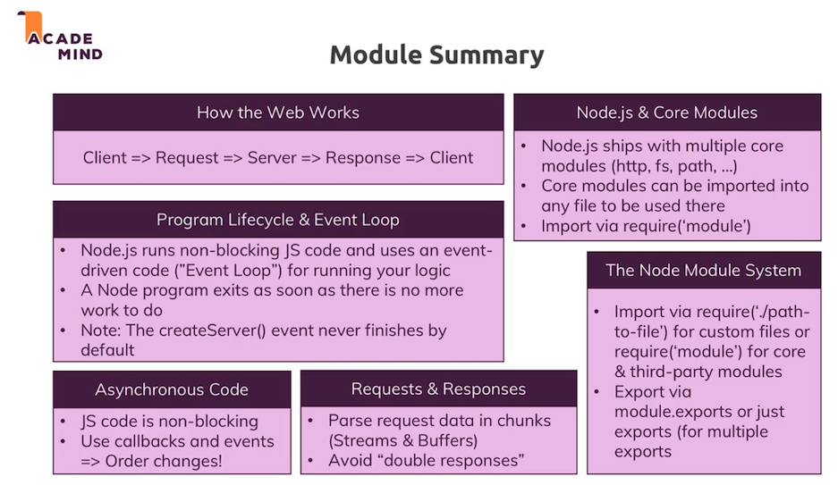

# M1: Basics

## Useful resources:

1. Official Node.js Docs: https://nodejs.org/en/docs/guides/
2. Full Node.js Reference (for all core modules): https://nodejs.org/dist/latest/docs/api/
3. More about the Node.js Event Loop: https://nodejs.org/en/docs/guides/event-loop-timers-and-nexttick/
4. Blocking and Non-Blocking Code: https://nodejs.org/en/docs/guides/dont-block-the-event-loop/

 

