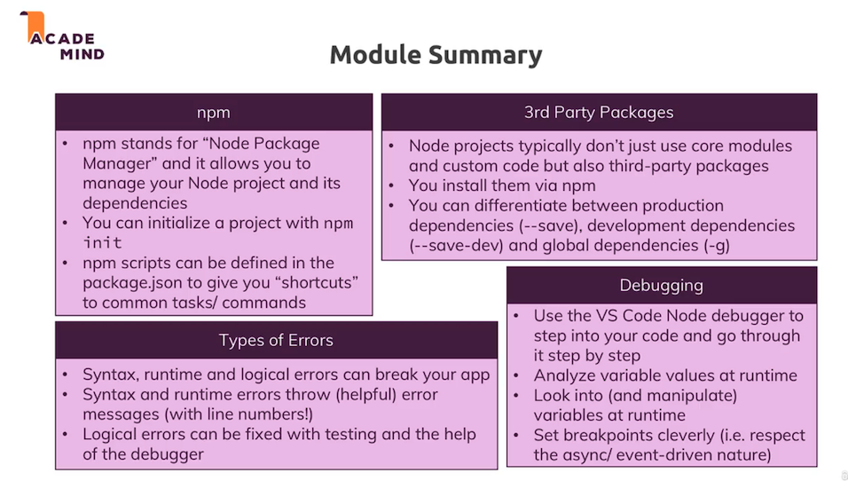

# M2: Workflow and Debugging

## Useful resources:

1. More on debugging Node.js: https://nodejs.org/en/docs/guides/debugging-getting-started/
2. Debugging Node in Visual Studio Code: https://code.visualstudio.com/docs/nodejs/nodejs-debuggingThis article will be very helpful: https://code.visualstudio.com/docs/nodejs/nodejs-debugging

 

 